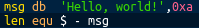

<h1> Assembly4Noobs </h1>

  

 Assembly4Noobs faz parte do projeto <a href="https://github.com/he4rt/4noobs">4noobs</a> da comunidade He4rt!

<h1>Sobre o Projeto</h1>

Aprenda a linguagem Assembly do zero!

 

Requisitos: Nenhum requisito é necessário, mas é recomendável lógica de programação 

Conteudo:

<ol>
<li><a href="curso/introducao.md">Introdução</a></li>
<li><a href="curso/syntax.md">Syntax</a></li>
</ol>

<h2>Autores:</h2>

André Luís - <a src="https://github.com/andreluispy">github</a>

