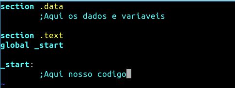

<h1>Aqui iremos aprender sobre alguns elementos dos scripts Assembly</h1>

Sobre as diferenças do assembly, temos sintaxes diferentes!
Esta tabela resume as principais diferenças das sintaxes Assembly INTEL e AT&T:

<table><thead>
<tr>
<th></th>
<th>Intel</th>
<th>AT&amp;T</th>
</tr>
</thead><tbody>
<tr>
<td>Comentários</td>
<td><code>;</code></td>
<td><code>//</code></td>
</tr>
<tr>
<td>Instruções</td>
<td> <code>add</code></td>
<td><code>addq</code></td>
</tr>
<tr>
<td>Registros</td>
<td><code>eax</code>, <code>ebx</code>, Etc.</td>
<td><code>%eax</code>, <code>%ebx</code>, Etc.</td>
</tr>
<tr>
<td>Imediatos</td>
<td>0x100</td>
<td>$ 0x100</td>
</tr>
<tr>
<td>Indireto</td>
<td><code>[eax]</code></td>
<td><code>(%eax)</code></td>
</tr>
<tr>
<td>Indireta geral</td>
<td><code>[base + reg + reg * scale + displacement]</code></td>
<td><code>displacement(reg, reg, scale)</code></td>
</tr>
</tbody></table>

 Nesse curso trataremos da sintaxe Intel e Assembly x86 usando o sistema Linux, alguns codigo podem não funcionar no Windows, caso queira mostrar um codigo que não funciona no Windows, abra uma Issue!

No assembly usamos o <code>;</code> para criar comentarios no codigo! Além disso, dividimos nosso codigo em seções, vejamos: <h2>.DATA</h2> Na .data, como o nome sugere, é uma região do código que será usada para tratar as informações, os dados, as variáveis.<

Nesse trecho (geralmente o inicial), declaramos e inicializamos as variáveis.

<b>OBS: Na .bss section, fazemos algo parecido, porém não inicializamos as informações de imediato.</b>

<h2>.TEXT</h2> 
Por fim, a .text section é o local onde irá ficar armazenado suas instruções, que irão trabalhar com os dados previamente declarados.
Essa é a única seção obrigatória, pois conterá a label (rótulo) _start, que é o local onde os executáveis são inicializados, _start é como o main() do C.

<b>Comando global:</b> Usado para declarar labels globais, ou seja, passíveis de uso externo.

Geralmente usamos para declarar o label principal, o _start.

Portanto, o nosso esqueleto de código será:

Lembrando que a identação não é nescessária no compilador NASM.

<a href="3-helloworld.md">proximo - Hello World</a>
