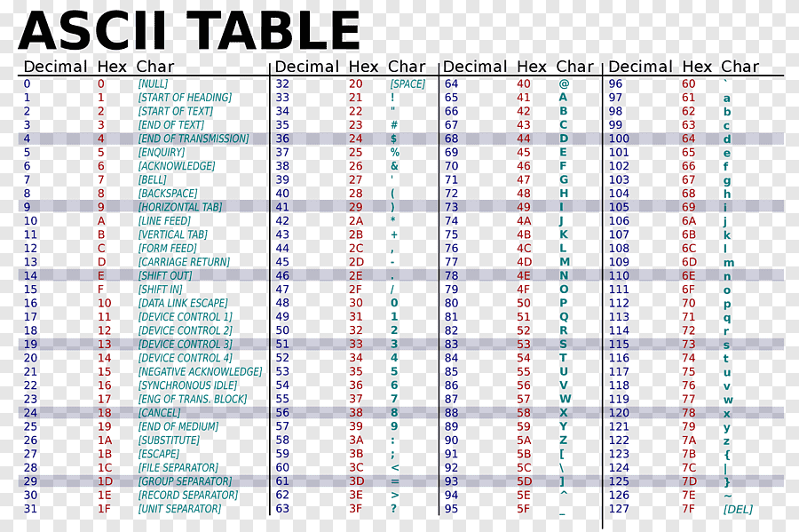

# Dados em Assembly

## Aqui veremos sobre os tipos de dados em Assembly

 Como enfatizamos, Assembly é em baixo nível. Trabalhamos com bits e bytes. E nesse nível, as coisas não vem prontas.

Vamos usar as seguintes variações da diretiva define: DB, DW, DD, DQ e DT.

Eles significam e alocam determinados número de bytes, veja:

DB = Define Byte -> aloca 1 byte

DW = Define Word -> aloca 2 bytes

DD = Define Doubleword -> aloca 4 bytes

DQ = Define Quadword -> aloca  8 bytes

DT = Define Ten -> aloca 10 bytes

Lembrando que o db por exemplo defini 1 byte que é equivalente a 1 caractere então a string 'A' é 1 byte porém quando passamos um valor maior que 1 byte por exemplo 'Hello' que seriam 5 bytes, para cada letra extra o assembl cria outro byte pra essa letra assim ajudando os desenvolvedores!

Sabendo disso, poderemos agora mostrar como é a sintaxe de uma instrução em Assembly para alocar memória:

nome diretiva_define valor

Lembrando que isso deve ser escrito na `section .data`

Por exemplo, para alocar espaço para o caractere 'A', fazemos:

`letra1 db 'A'`

Lembramos que, na verdade, embora tenhamos escrito o caractere 'A', tudo são números.

Então, como na tabela ASCII o valor de 'A', em hexadecimal é 41, poderíamos ter feito:

`letra1 DB 41H`

Colocamos a letra H ao final do número para dizer que estamos representando em Hexadecimal.

Se fossemos colocar em binário, temos que colocar a letra B ao final:

letra1  DB 01000001B

Veja aqui a tabela ASCII:

Na tabela ASCII temos alguns simbolos que fazem coisas especiais como o 0xA que faz uma quebra de linha

## Reservando memória em Assembly

 Até agora, usando as diretivas define (DB, DW, DD, DQ e DT), onde alocamos memória em Assembly para armazenar e INICIALIZAR variáveis! Porém, nem sempre vamos inicializar, apenas queremos alocar.

Isso é comum para armazenar variáveis cujos valores serão fornecidos posteriormente

Para reservar memória, usamos a diretiva RES, ao mesmo molde da diretiva DEFINE:

RESB = Reserve Byte -> reserva 1 byte

RESW = Reserve Word -> reserva 2 bytes

RESD = Reserve Doubleword   -> reserva 4 bytes

RESQ = Reserve Quadword     -> reserva 8 bytes

REST = Reserve Ten -> reserva 10 bytes

O RESB é usado na `section .bss` e usamos ele na aula passada de input

Sintaxe para reservar memória:

nome diretiva_res numero_de_unidades

Por exemplo:

variavel1 RESB 1 ; nesse caso, reservamos apenas 1 byte

variavel2 RESB 2 ; aqui, reservamos 2 bytes

variavel3 RESW 3 ; 3 palavras são reservadas, o que nos dá 3*2 = 6 bytes

variavel4 REST 10 ; reservamos 10 unidades, de 10 bytes cada

[PROXIMO - Comparação](7-comparacao.md)
