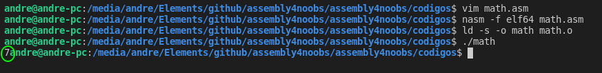

# Aqui me despeço e deixo alguns caminhos e conteudos de ultima hora

Algo que é interessante sabe é tudo que você pode passar pros [eax, ebx, ecx, edx] e registradores extras que não mostrei aqui, imagina tudo isso reunido numa tabela! E sim, temos aqui a tabela e ainda para assembly x64 bits e outros, basta acessar esse link: [https://chromium.googlesource.com/chromiumos/docs/+/master/constants/syscalls.md](https://chromium.googlesource.com/chromiumos/docs/+/master/constants/syscalls.md)

Além disso queria tratar um pouco de matematica em assembly:

A variavel que contem o valor vai ser uma string pra poder ser exibida no console, depois passamos ela como ponteiro dela para eax: `mov eax, [n1]`, depois convertemos ela pra int usado: `sub eax, '0'`, depois usamos o add para somar um valor pra ela: `add eax, 5`, depois convertemos para string usando: `add eax, '0'`, depois retornamos pra variavel o valor de `eax`: `mov [n1], eax`, vejamos o codigo real:

```
section .data
	n1 dd "5"

section .text
global _start
_start:
	mov eax, [n1]
	sub eax, '0'  ;Converte para int
	add eax, 2    ;Adiciona 5
	add eax, '0'  ;Converte para string
	mov [n1], eax

	mov eax, 4    ;SYS_WRITE
	mov ebx, 1    ;STD_OUT
	mov ecx, n1   ;SAIDA
	mov edx, 1    ;TAMANHO
	int 0x80

	mov eax, 1
	int 0x80
```

Resultado:



Outra coisa interessante é se eu chamar uma label eu posso usar o `ret` para retornar para o `_start`, veja:

```
section .data
    msg db  'Hello World', 0xA
    len equ $ - msg

section .text
global _start
_start:
    call out

    ;Codigo de saida
    mov eax, 1
    int 0x80

out:
    mov eax, 4
    mov ebx, 1
    mov ecx, msg
    mov edx, len
    int 0x80
    ret ;Retornar para start
```

Bem, aqui me despeço e posso afirmar que nesse curso mostrei o basico de Assembly x86 pra Ubuntu!

[Click Para voltar README.md](../README.md)
