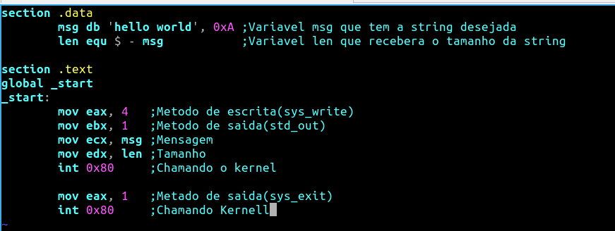

<h1>O Hello World!</h1>

Aqui trataremos como fazer um hello world e iremos explicar cada coisa!  Em Assembly temos 4 comandos  - ax, Acumulador para operações numericas  -bx, acumulador de registro base  -cx, registro de contas realizado com string  -dx, registro de dados  Normalmente são acompanhados da letra E que é compativel com computadores 32 bits e também 64 bits, somente no assembly 64 bits podemos usar a letra R, no curso usarei a letra E para ser compivel com os dois tipos de sistemas O comando <code>mov</code> é usado para mover valores e normalmente usamos eles pra passar valores para os comandos [eax, ebx, ecx, edx], vejamos os seus usos Comentados no hello world abaixo(lembrando que os scripts assembly tem a extensão .asm então criei o arquivo <code>hello.asm</code>):

Agora temos que compilar o script .asm para poder ser execultado! Linux: Abrimos a pasta onde o arquivo está no terminal e compilamos com o nasm: <code>nasm -f elf64 hello hello.asm</code>, o hello.asm é nosso arquivo assembly e o elf64 é a arquitetura do sistema alvo, elf64 é usado para sistemas x64 bits e elf32 é usado para sistemas x32 bits. Esse comando irá gera o arquivo hello.o que é o codigo de maquina e o hello.o compilamos pra execulvel digitando: <code>ld -s -o hello hello.o</code>, hello é o arquivo execultavel gerado que como sabemos o linux não precisa de extensão e hello.o é nosso arquivo codigo de maquina gerado pelo nasm. Para execultar o arquivo execultavel hello no terminal digitamos <code>./hello</code>  Windows: Abrindo a pasta onde o script está no terminal digitamos <code>nasm -f win32 hello.asm -o hello.o</code>, o win32 é a arquitetura destinada caso queira para 64 bits digitamos win64 e hello.o é o arquivo de codigo de maquina gerado, depois disso digitamos <code>ld hello.o -o hello.exe</code>, hello.o é o codio de maquina e hello.exe é o execultavel gerado que pode ser execultado por duplo click ou então pelo cmd!

<a href="labels.md"> Proximo - Labels</a>